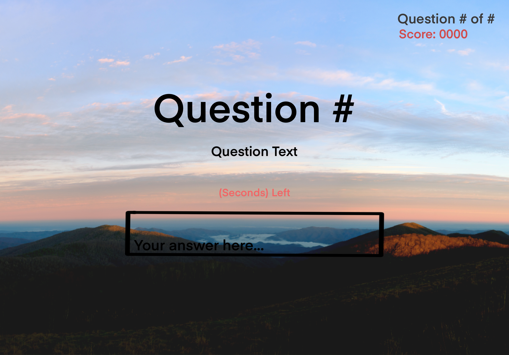

# Self-Scoring-Trivia

## Project Choice (Tell us which project you're doing!)

- [ ] Flash Cards
- [x] Trivia (Self-scoring)
- [ ] Spaceman
- [ ] Tower of Hanoi
- [ ] Simon

## Project Description

A self scoring game of trivia that will run through 20 various questions about photography.

## Wire Frames

## User Stories

### MVP Goals

- As a player, I would like to have instructions on how to play
- As a player, I would like to have a countdown timer to keep me on my toes
- As a player, I would like to have a field to input answers
- As a player, I would like to have my score tracked by the game and not myself

### Stretch Goals

- As a player, I would like to have a questions randomized everytime I play
- As a player, I would like to have a leadboard to compete with
- As a player, I would like to have a reaction(animation) if I get an answer correct or wrong
- As a player, A background soundtrack would be nice to my ears
- As a player, I would like a score deduction for every wrong answer
