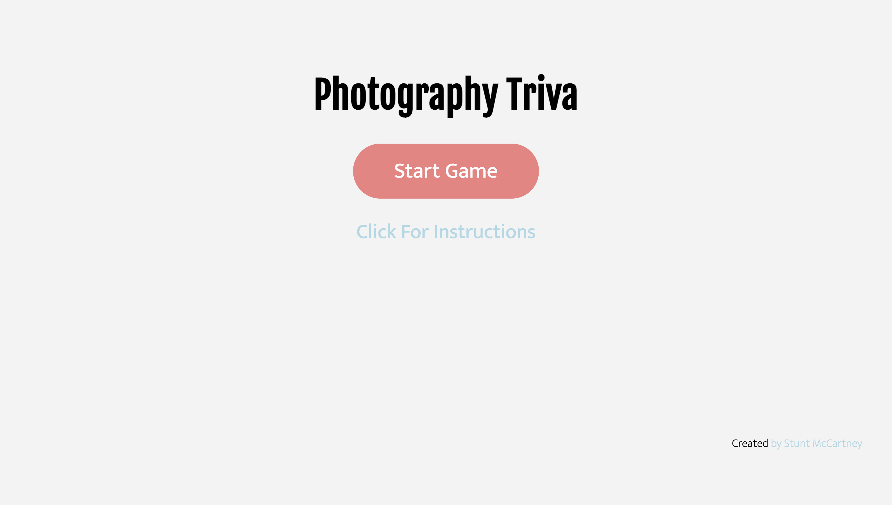
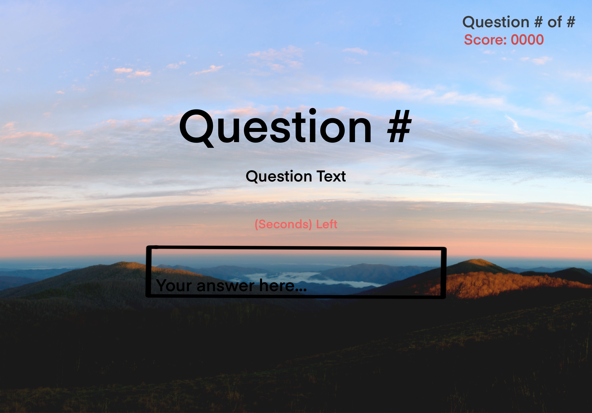

# Self Scoring Trivia: Photography Edition

## Technologies Used
- HTML
- CSS
- Javascript

## Installation

1. Clone down repository
2. Open 'index.html' in browser
3. Make sure you can see " " in your console
4. Success!

## User Stories

### MVP Goals

- As a player, I would like to have instructions on how to play
- As a player, I would like to have a countdown timer to keep me on my toes
- As a player, I would like to have a field to input answers
- As a player, I would like to have my score tracked by the game and not myself

### Stretch Goals

- As a player, I would like to have a questions randomized everytime I play
- As a player, I would like to have a leadboard to compete with
- As a player, I would like to have a reaction(animation) if I get an answer correct or wrong
- As a player, A background soundtrack would be nice to my ears
- As a player, I would like a score deduction for every wrong answer

## Wire Frames

## Unsolved Problems

- Couldn't get timer to stop at 0 seconds
- Couldn't get final score screen to show
- Couldn't get score to stop registering after final question was answered